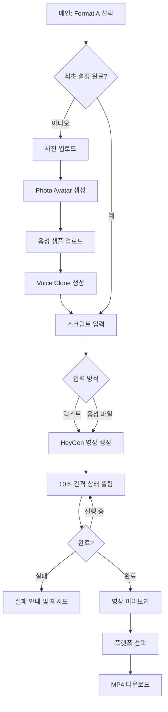

# HARNESS 기획안 — 오토사장
> 기준 문서: `PRD_FitnessContentSaaS.md` v0.2  
> 작성일: 2026-04-28  
> 목적: PRD를 실제 MVP 개발, 검증, 운영 준비 단위로 재구성

---

## 1. 기획 결론

오토사장 MVP는 **Format A — 아바타 토킹헤드**만 정식 구현한다.

Format B와 Format C는 PRD에는 포함하되, MVP에서는 다음처럼 처리한다.

- Format B: 포맷 선택 화면에 노출하되 `준비 중` 상태로 둔다.
- Format C: 포맷 선택 화면에 노출하되 `베타 예정` 상태로 둔다.
- 개발, API 연동, QA, 베타 테스트는 Format A 성공률과 재사용률 확보에 집중한다.

MVP의 핵심 가설은 다음이다.

> 피트니스·의료 전문가가 촬영과 편집 없이도 자기 얼굴과 목소리로 신뢰감 있는 숏폼 콘텐츠를 만들면, 반복적으로 사용할 의향이 생긴다.

---

## 2. HARNESS 구조

### H — Hypothesis

사용자는 콘텐츠 아이디어와 스크립트는 있지만 촬영, 편집, 말하기 부담 때문에 릴스 제작을 미룬다.

오토사장이 다음 3가지를 해결하면 베타 사용자 10명 이상에게 실사용 가치가 있다.

- 사진 1장으로 본인 아바타를 만든다.
- 음성 샘플로 본인 목소리를 복제한다.
- 500자 이하 스크립트를 입력하면 60초 이내 9:16 MP4를 생성한다.

### A — Audience

1차 대상은 trainer.milestone / Biz Auto System 수강생 중 콘텐츠 제작 니즈가 있는 전문가다.

우선순위 사용자:

1. 개인 피트니스 트레이너
2. 물리치료사, 스포츠 재활 전문가
3. 헬스센터 운영자
4. 건강 콘텐츠 크리에이터

초기 사용자는 일반 대중이 아니라 이미 신뢰 기반 비즈니스를 운영하거나 준비 중인 전문가로 본다.

### R — Requirements

MVP 필수 범위:

- 포맷 선택 메인
- 사진 업로드
- Photo Avatar 생성 요청 및 상태 확인
- 음성 샘플 업로드
- Voice Clone 생성 요청
- 스크립트 입력
- 음성 파일 직접 업로드 옵션
- 영상 생성 요청
- 10초 간격 상태 폴링
- 완성 영상 미리보기
- 플랫폼 선택 후 다운로드

MVP 제외 범위:

- Format B 실제 합성
- Format C 타임라인 편집
- 로그인/회원가입
- 결제
- 사용량 제한
- 관리자 대시보드
- AI 인포그래픽 자동 생성
- 고급 자막 편집

### N — Narrative

사용자는 “오늘 올릴 운동 팁”을 텍스트로 준비한다.

처음 한 번만 자기 사진과 목소리를 등록한다. 이후에는 스크립트를 입력하고 생성 버튼을 누르면, 자기 얼굴과 목소리로 말하는 숏폼 영상이 완성된다. 사용자는 영상을 확인하고 인스타 릴스, 유튜브 쇼츠, 틱톡에 맞춰 다운로드한다.

서비스 메시지는 다음처럼 잡는다.

- 메인 메시지: `내 얼굴, 내 목소리로 — 텍스트만 입력하면 릴스 완성`
- 보조 메시지: `촬영 없이, 편집 없이, 전문가 콘텐츠를 3분 안에`
- CTA: `첫 영상 만들기`

### E — Experience

MVP 화면 경험은 5단계로 단순화한다.

1. 포맷 선택
2. 최초 설정
3. 스크립트 입력
4. 생성 대기
5. 미리보기 및 다운로드

화면별 기획:

| 화면 | 사용자 목적 | 핵심 UI |
|---|---|---|
| 메인 | 만들 포맷 선택 | Format A 카드, Format B/C 준비 중 카드 |
| 아바타 설정 | 본인 사진 등록 | 업로드 박스, 권장 가이드, 생성 상태 |
| 보이스 설정 | 목소리 등록 | 업로드 박스, 샘플 길이 안내, 생성 상태 |
| Format A 제작 | 영상 내용 입력 | 스크립트 textarea, 음성 파일 옵션, 생성 버튼 |
| 생성 대기 | 진행 상태 확인 | 단계형 progress, 예상 시간, 폴링 상태 |
| 완료/다운로드 | 결과 확인 | 영상 플레이어, 플랫폼 선택, 다운로드 버튼 |

### S — Success

MVP 성공 기준:

| 지표 | 목표 | 측정 방식 |
|---|---|---|
| 영상 생성 성공률 | 95% 이상 | 생성 요청 대비 완료 건수 |
| 평균 생성 시간 | 3분 이내 | generate 요청부터 완료까지 |
| 사용자 재사용률 | 1주 내 2회 이상 | 동일 사용자 반복 생성 횟수 |
| 베타 사용자 수 | 10명 이상 | 수강생 대상 실사용 |
| 실패 원인 분류율 | 100% | 실패 상태와 API 오류 로그 저장 |

---

## 3. MVP 사용자 플로우



---

## 4. 정보 구조

```text
/
  메인 포맷 선택

/setup/avatar
  사진 업로드
  Photo Avatar 생성 상태

/setup/voice
  음성 샘플 업로드
  Voice Clone 생성 상태

/create/talking-head
  스크립트 입력
  음성 파일 업로드 옵션
  영상 생성 요청

/jobs/[jobId]
  생성 상태
  진행률/예상 시간
  실패/재시도

/result/[videoId]
  영상 미리보기
  플랫폼 선택
  다운로드
```

---

## 5. 데이터 모델 초안

초기에는 인증 없이 베타 테스트를 진행할 수 있으나, 생성 추적을 위해 최소한의 job/session 데이터는 필요하다.

### `avatar_profiles`

| 필드 | 설명 |
|---|---|
| `id` | 내부 프로필 ID |
| `session_id` | 베타 사용자 식별용 임시 ID |
| `photo_avatar_id` | HeyGen Photo Avatar ID |
| `voice_id` | HeyGen Voice Clone ID |
| `created_at` | 생성일 |

### `generation_jobs`

| 필드 | 설명 |
|---|---|
| `id` | 내부 job ID |
| `session_id` | 사용자 식별 |
| `format` | `format_a` |
| `script` | 입력 스크립트 |
| `input_audio_url` | 직접 업로드 음성 파일 URL |
| `heygen_video_id` | HeyGen 영상 ID |
| `status` | `queued`, `processing`, `completed`, `failed` |
| `result_video_url` | 완료 영상 URL |
| `error_code` | 실패 코드 |
| `error_message` | 실패 메시지 |
| `created_at` | 요청 시간 |
| `completed_at` | 완료 시간 |

---

## 6. API 기획

### 내부 API

| API | 역할 | MVP 여부 |
|---|---|---|
| `POST /api/avatar/create` | 사진 업로드 후 Photo Avatar 생성 | 필수 |
| `GET /api/avatar/status/:id` | 아바타 생성 상태 확인 | 필수 |
| `POST /api/voice/clone` | 음성 샘플 업로드 후 Voice Clone 생성 | 필수 |
| `POST /api/video/generate` | Format A 영상 생성 요청 | 필수 |
| `GET /api/video/status/:id` | 영상 상태 폴링 | 필수 |
| `POST /api/video/composite` | Format B 합성 | 제외 |
| `POST /api/subtitle/generate` | Whisper 자막 생성 | 제외 |

### 상태 정의

| 상태 | 사용자 문구 |
|---|---|
| `idle` | 생성 준비 중 |
| `uploading` | 파일 업로드 중 |
| `avatar_processing` | 아바타 생성 중 |
| `voice_processing` | 목소리 생성 중 |
| `video_processing` | 영상 생성 중 |
| `completed` | 영상 생성 완료 |
| `failed` | 생성 실패 |
| `timeout` | 생성 시간이 초과됨 |

---

## 7. 화면별 요구사항

### P-01 메인

- Format A를 가장 큰 카드로 배치한다.
- Format B/C는 향후 제공 포맷으로 노출한다.
- CTA는 `첫 영상 만들기`로 둔다.
- 모바일에서 포맷 카드가 한 열로 자연스럽게 쌓이도록 한다.

### P-02 아바타 설정

- JPG/PNG, 최대 10MB 제한을 적용한다.
- 정면 얼굴 사진 권장 안내를 제공한다.
- 업로드 후 바로 생성 요청을 보낸다.
- 생성 중에는 다른 단계로 넘어가지 못하게 한다.

### P-03 보이스 설정

- WAV/MP3 업로드를 지원한다.
- 30초~3분 권장 문구를 표시한다.
- 생성 완료 후 `voice_id`를 저장한다.

### P-04 Format A 제작

- 스크립트 최대 500자를 제한한다.
- 글자 수 카운터를 표시한다.
- 텍스트 입력과 음성 파일 업로드 중 하나를 선택하게 한다.
- 생성 버튼 클릭 시 필수 값 검증을 수행한다.

### P-07 생성 대기

- 10초 간격으로 상태를 확인한다.
- 최대 10분 타임아웃을 적용한다.
- 현재 단계와 예상 시간을 표시한다.
- 실패 시 재시도 버튼을 제공한다.

### P-08 완료/다운로드

- 인앱 MP4 플레이어를 표시한다.
- 플랫폼 선택값은 우선 다운로드 파일명 또는 안내 문구에 반영한다.
- MVP에서는 릴스/쇼츠/틱톡 모두 동일한 1080x1920 MP4를 제공한다.

---

## 8. 개발 마일스톤

### Sprint 0 — 기반 세팅

- Next.js 14 App Router 프로젝트 생성
- Tailwind CSS + shadcn/ui 설정
- 환경변수 구조 정리
- 기본 라우팅 및 레이아웃 구성

완료 기준:

- 로컬에서 메인 화면 접근 가능
- Vercel 배포 가능한 상태
- `HEYGEN_API_KEY`가 서버에서만 참조됨

### Sprint 1 — Format A 설정 플로우

- 사진 업로드 UI
- 아바타 생성 API route
- 아바타 상태 폴링
- 음성 업로드 UI
- Voice Clone API route

완료 기준:

- 실제 HeyGen API로 avatar/voice ID를 받을 수 있음
- 실패 상태가 사용자에게 표시됨

### Sprint 2 — 영상 생성 플로우

- 스크립트 입력 UI
- 음성 파일 업로드 옵션
- 영상 생성 API route
- 영상 상태 폴링 화면
- 완료 영상 URL 저장

완료 기준:

- 텍스트 입력만으로 Format A 영상 생성 가능
- 실패/타임아웃/재시도 경로가 동작함

### Sprint 3 — 결과 및 베타 준비

- 영상 미리보기
- 플랫폼 선택
- 다운로드
- 생성 로그 정리
- 베타 테스트 체크리스트 작성

완료 기준:

- 베타 사용자 10명에게 공유 가능한 MVP 링크 확보
- 생성 성공률, 생성 시간, 실패 원인 측정 가능

---

## 9. QA 체크리스트

- 10MB 초과 사진 업로드가 차단되는가
- 지원하지 않는 이미지 확장자가 차단되는가
- 지원하지 않는 오디오 확장자가 차단되는가
- 500자 초과 스크립트가 차단되는가
- API 키가 클라이언트 번들에 포함되지 않는가
- 생성 상태 폴링이 10초 간격으로 동작하는가
- 10분 초과 시 timeout 상태로 전환되는가
- HeyGen 실패 응답이 사용자에게 이해 가능한 문구로 표시되는가
- 완료 영상이 인앱에서 재생되는가
- 다운로드 파일이 MP4로 저장되는가
- 모바일 Safari에서 주요 플로우가 깨지지 않는가

---

## 10. 리스크와 대응

| 리스크 | 영향 | 대응 |
|---|---|---|
| HeyGen API 응답 지연 | 생성 시간 목표 초과 | 상태 문구와 타임아웃 처리 강화 |
| Voice Clone 품질 편차 | 사용자 만족도 저하 | 샘플 녹음 가이드 제공 |
| 사진 품질 문제 | 아바타 생성 실패 | 정면/밝은 사진 가이드 제공 |
| 베타에서 API 비용 증가 | 운영 비용 부담 | 베타 사용자/생성 횟수 제한 |
| 인증 없는 MVP의 사용자 식별 문제 | 재사용률 측정 어려움 | 임시 session ID 저장 |

---

## 11. 의사결정 필요 항목

1. HeyGen API 플랜과 실제 사용 가능 엔드포인트 확인
2. MVP에서 파일 저장소를 Supabase Storage로 할지 Vercel Blob으로 할지 결정
3. 인증 없는 베타로 시작할지, Supabase Auth를 최소 적용할지 결정
4. 생성된 영상 파일을 24시간 뒤 삭제할지, 베타 기간 동안 보관할지 결정
5. autosajang.com / otosajang.com 중 도메인 확정

---

## 12. 첫 구현 우선순위

1. 포맷 선택 메인
2. Format A 제작 화면 UI
3. 서버사이드 HeyGen API wrapper
4. 사진/음성 업로드 처리
5. 생성 job 상태 모델
6. 상태 폴링 화면
7. 결과 미리보기/다운로드

이 순서로 가면 API 연동 전에도 클릭 가능한 프로토타입을 먼저 만들 수 있고, 이후 HeyGen 실연동을 점진적으로 붙일 수 있다.
